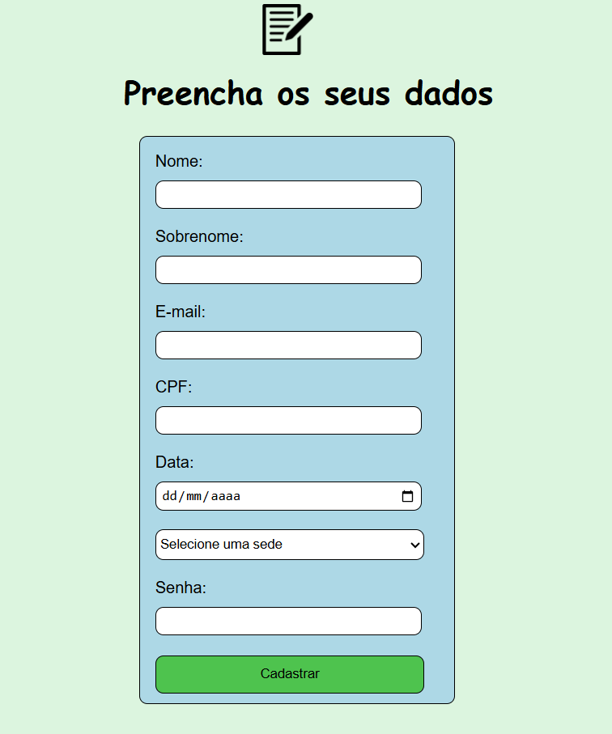

# TELA INICIAL DE UM FORMULÁRIO
Um tela simples de um formulário apenas para exercitar HTML e CSS. 

# HTML
Usado as tags: 
- h1
- img 
- div 
- br 
- form

# CSS Foi usados:
- background-color
- font-family
- width
- margin-left
- margin-top
- padding
- height
- border
- border-radius

# TELA
